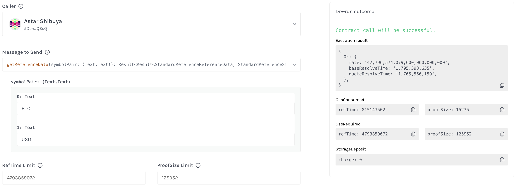

# Band Protocol's ink! Standard Reference Contracts

## Overview

This repository contains the ink! code for Band Protocol's StdReference contracts. The live contract addresses can
be found in our [documentation](https://docs.bandchain.org/develop/supported-blockchains/).

### Contract Compilation

#### Option 1: Using Docker

To compile the Standard Reference Contract on Intel architecture, use the following command:

```bash
cd /contracts/std_ref

docker run --rm -it -v $(pwd):/contracts/std_ref paritytech/contracts-ci-linux \
  cargo contract build --release --manifest-path=/contracts/std_ref/Cargo.toml
```

To compile on M1 architecture, use the following command:

```bash
cd /contracts/std_ref

docker run --rm -it -v $(pwd):/contracts/std_ref --platform linux/amd64 paritytech/contracts-ci-linux \
  cargo contract build --release --manifest-path=/contracts/std_ref/Cargo.toml
```

#### Option 2: Using Cargo Contract (Recommended)

To compile the Standard Reference Contract, you'll need to use cargo-contract, a tool for working with smart contracts in the Rust programming language.

1. Install Cargo contract

   - Step 1: `rustup component add rust-src`.
   - Step 2: `cargo install --force --locked cargo-contract`.

2. Run the build command. For contracts intended to run in production, you should always build the contract with --release:

   ```bash
   cargo contract build --release
   ```

## Usage

To query the prices from Band Protocol's StdReference contracts, the contract looking to use the price values should query Band Protocol's `std_reference` contract.

### QueryMsg

The query messages used to retrieve price data for price data are as follows:

```rust
pub enum QueryMsg {
    GetReferenceData {
        // Symbol pair to query where:
        // symbol_pair := (base_symbol, quote_symbol)
        // e.g. BTC/USD = ("BTC","USD")
        symbol_pair: (String, String),
    },
    GetReferenceDataBulk {
        // Vector of Symbol pair to query
        // e.g. <BTC/USD ETH/USD> = <("BTC","USD"),("ETH","USD")>
        symbol_pairs: Vec<(String, String)>,
    },
}
```

### ReferenceData

`ReferenceData` is the struct that is returned when querying with `GetReferenceData` or `GetReferenceDataBulk` where the
bulk variant returns `Vec<ReferenceData>`

`ReferenceData` is defined as:

```rust
pub struct ReferenceData {
    // Pair rate e.g. rate of BTC/USD
    pub rate: u128,
    // Unix time of when the base asset was last updated. e.g. Last update time of BTC in Unix time
    pub last_updated_base: u64,
    // Unix time of when the quote asset was last updated. e.g. Last update time of USD in Unix time
    pub last_updated_quote: u64,
}
```

## Examples

### Using the Contracts UI

This example use [StdReferenceBasic contract](https://shibuya.subscan.io/account/YhesbtnjHC7srVHN2f69vQiRwwLNYBTuUN15Z5NJzygimrF) on Astar Shibuya.

Follow these steps:

1. Navigate to https://contracts-ui.substrate.io/address-lookup
2. Paste the contract address `YhesbtnjHC7srVHN2f69vQiRwwLNYBTuUN15Z5NJzygimrF`
3. Modify the contract's name
4. upload metadata from `band-std-reference-contracts-ink/contracts/std_ref/metadata/standard_reference.json`
5. You can now interact with the contract

#### Single Query

This example demonstrates how to query the price of cryptocurrencies, such as BTC/USD and ETH/USD, using the get_reference_data function.



The result from the `get_reference_data` function

```text
{
  Ok: {
    rate: '42,796,574,079,000,000,000,000',
    baseResolveTime: '1,705,393,635',
    quoteResolveTime: '1,705,566,198',
  },
}
```

and the results can be interpreted as:

- BTC/USD
  - `rate = 42796.57 BTC/USD`
  - `lastUpdatedBase = 1705393635`
  - `lastUpdatedQuote = 1705566198`

#### Bulk Query

This example demonstrates how to perform bulk queries for multiple cryptocurrency pairs using the get_reference_data_bulk function.


The result from the `get_reference_data_bulk` function

```text
[
  {
    Ok: {
      rate: '42,796,574,079,000,000,000,000',
      baseResolveTime: '1,705,393,635',
      quoteResolveTime: '1,705,566,390',
    },
  },
  {
    Ok: {
      rate: '2,529,382,050,297,000,000,000',
      baseResolveTime: '1,705,393,635',
      quoteResolveTime: '1,705,566,390',
    },
  },
]
```

and the results can be interpreted as:

- BTC/USD
  - `rate = 42796.57 BTC/USD`
  - `lastUpdatedBase = 1705393635`
  - `lastUpdatedQuote = 1705566198`
- ETH/USD
  - `rate = 2529.38 ETH/USD`
  - `lastUpdatedBase = 1705393635`
  - `lastUpdatedQuote = 1705566198`
